# Active Directory Project

**Active Directory (AD)** is Microsoft’s centralized directory service used in Windows-based networks. It enables administrators to manage users, computers, groups, policies, and other resources from a single, structured platform. With AD, access control, resource organization, and security policies can be applied consistently across the entire network.

Active Directory serves as the backbone of many enterprise IT environments, supporting key features like **Single Sign-On (SSO)**, **Group Policy management**, and **domain-based administration**. Its scalable and secure architecture makes it ideal for both small business networks and large, distributed organizations.

The objective of this project is to set up a functional **Active Directory environment** . The key goals include:

- Configuring a **Windows Server** as a **Domain Controller**
- Creating and managing a **new Active Directory domain**
- Joining **Windows machines** to the domain
- Creating **Organizational Units (OUs)** and **user accounts**
- Demonstrating basic **domain login functionality** and user management

### Project: Setting up Active Directory

---

### Prerequisites

Before you begin, make sure you have:

- Basic knowledge of Windows for navigating, editing files and settings.
- A Windows system
- A Windows server for the Active Directory

---

### Experimental Setup

The setup consists of a Windows 10 virtual machine and a Windows Server virtual machine, each allocated 2 GB of RAM and 50 GB of disk space. Both machines are deployed using Oracle VirtualBox and configured to operate within a 
NAT-based virtual network, utilizing the IPv4 address space `10.0.2.0/24`.

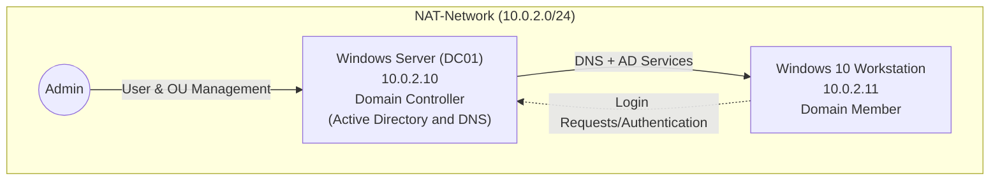

---

### Implementation Steps

### Step 1: Initial Configuration

**Windows Server**

- Give the server a significant name (e.g. `DC01`).
- Assign the server a static IP-address (`10.0.2.10`), subnetmask (`255.255.255.0`), gateway (`10.0.2.1`) and select the google DNS server (`8.8.8.8`) as preferred DNS server.

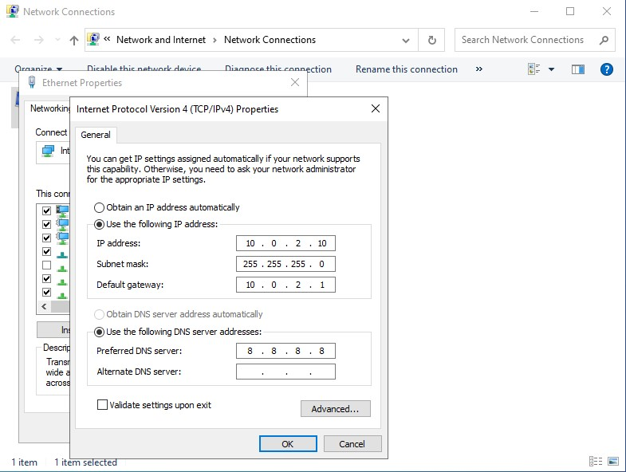

Network settings on the Windows server.

**Windows Workstation**

- Give the Windows host a significant name (e.g. `WorkstationWin01`).
- Assign the workstation a static IP-address (`10.0.2.11`), subnetmask (`255.255.255.0`), gateway (`10.0.2.1`) and select the IP of the domain controller as preferred and the google DNS server (`8.8.8.8`) as alternate DNS server.

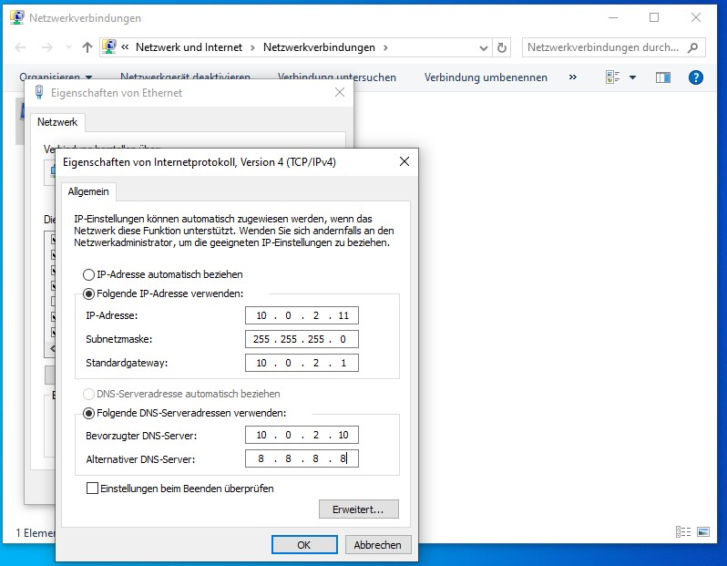

Network settings on the Windows host.

### Step 2: Domain Controller Setup

1. On the Windows server, open the “Server Manager”, then go to “Manage”, “Add Roles and Features” and click “Next”.
2. Ensure that “Role-based and feature-based installation” is selected and click “Next”.
    
    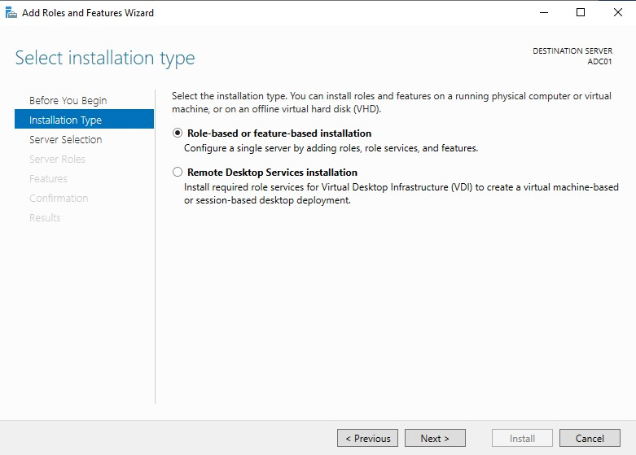
    
3. Select the server (`DC01`) and click “Next”.
4. Select “Active Directory Domain Services” and “Add Features”. Go “Next” untill you can click “Install”. 
    
    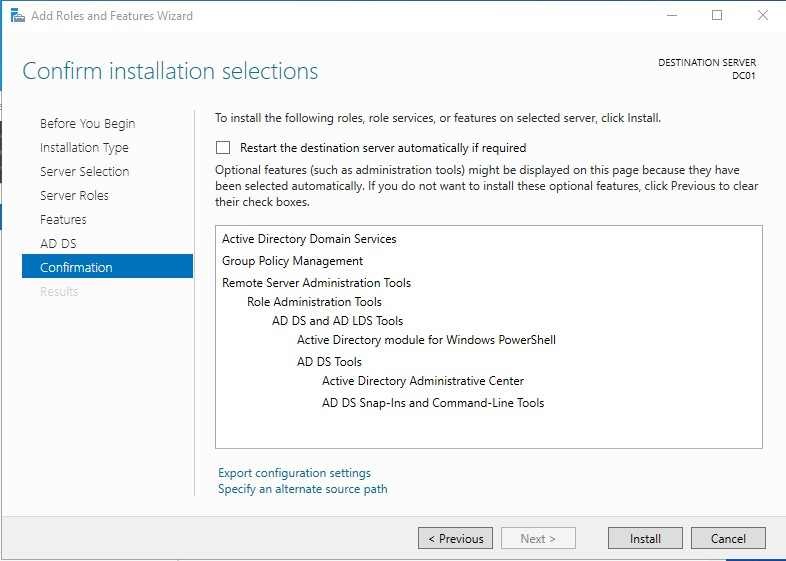
    
5. After the installation succeeded you will notice a notification in the top right corner on the flag icon. Click it and click on “Promote this server to a domain controller”.
    
    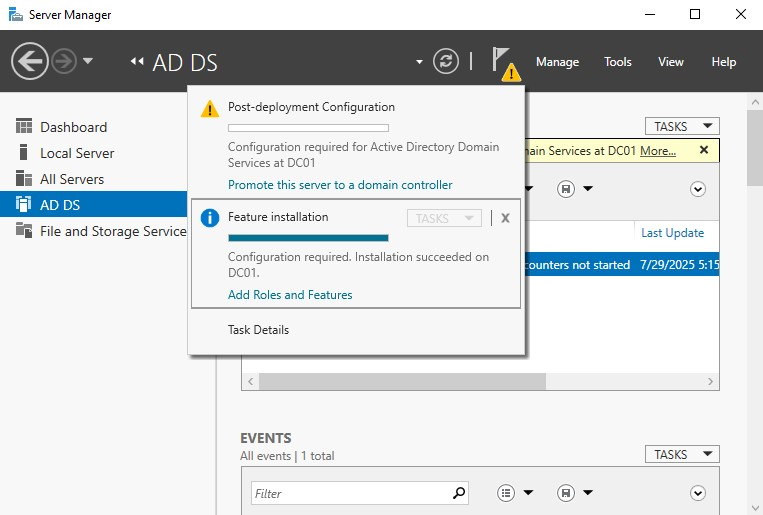
    
6. Select “Add a new forest” because we are creating a new domain and select a domain name (e.g. `doecorp.local`). Choose a top-level domain name that is not accessible through the internet (e.g. `.local`, `.host`). Click “Next”. 
    
    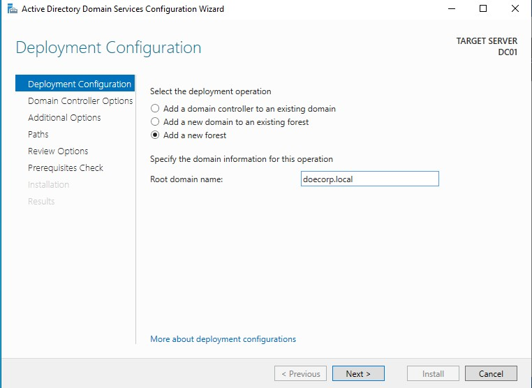
    
7. Choose a secure password and click “Next”.
8. For our purposes, we let everything on default and go “Next” until we can click “Install” and start the installation process. After the installation succeeded, the system reboots automatically. 
    
    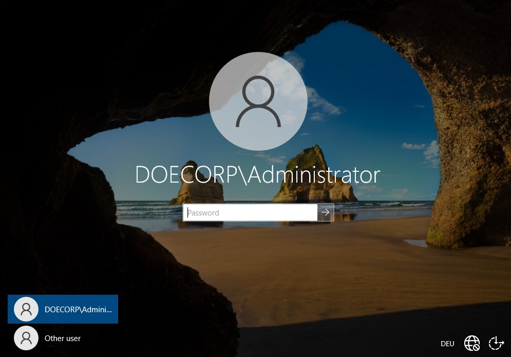
    
    Notice the domain name next to the account name.
    

### Step 3: Basic AD Management

**Domain Join: Workstation**

1. Go to “Advanced system settings” .
2. Under the “Computer Name” tab, click on “Change…”. 
    
    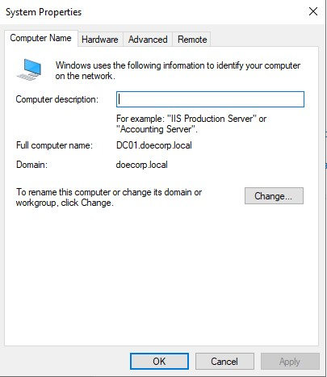
    
3. Insert the domain name of your newly created domain (`doecorp.local`). 
4. Enter the credentials of your domain controller. The system will restart. 

**User Creation**

1. Open the “Server Manager”.
2. Click in the top right corner on “Tools” and then on “ Active Directory-User and -Computer”.
3. Extend the domain (`doecorp.local`) on the left.
4. Right click on the domain, select “New” and “Organizational Unit” (OU) and choose a name (e.g. `IT`). You will see your newly created OU in the side bar on the left. 
    
    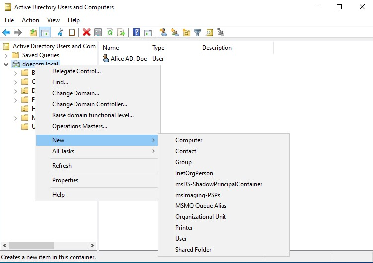
    
5. Right click on ur OU and create a new user in your OU by repeating step 4 but choosing “User” instead of “Organizational Unit”.
6. Insert the user’s credentials. 
    
    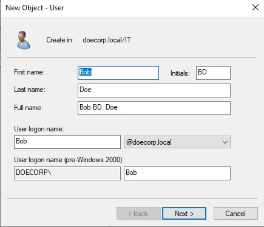
    
7. For our purpose we want to uncheck the option “User must change password at next logon”. 

---

### Verification & Testing

After setting up the Active Directory , we can restart the workstation and click on “Other User” in the bottom left corner of the login screen.

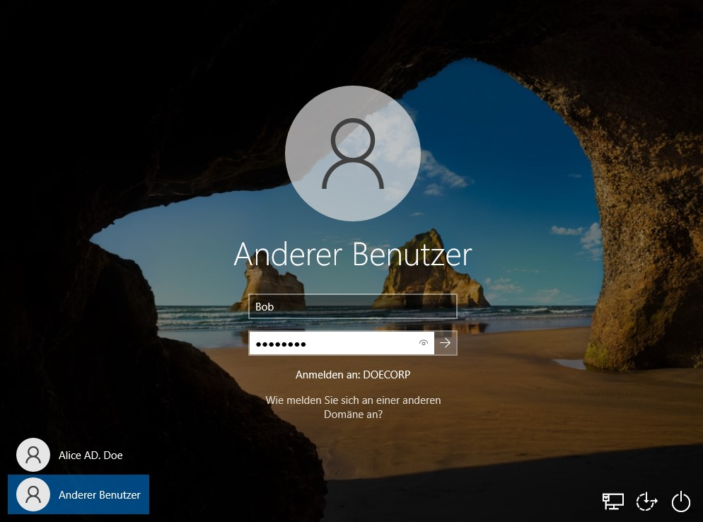

We will be able to login with the credentials of the newly created user `Bob`.

---

### Conclusion & Future Work

- **Summary of Project:** Recap of the achieved setup and its functionality.
- **Key Learnings:** How to set up Windows Active Directory, how to promote a Windows server to a domain controller and how to create and manage user accounts and OU’s within an Active Directory.
- **Potential Next Steps:** Configuring Group Policies (GPOs), setting up a DHCP server, or adding a Read-Only Domain Controller.

---

**RELATED PAGES**
