# Splunk Project

**Security Information and Event Management (SIEM)** systems are a cornerstone of modern cybersecurity operations. They provide a centralized platform for collecting, analyzing, and presenting security-related data from various sources across an organization's IT infrastructure.

At their core, SIEM solutions aggregate log and event data from network devices, servers, applications, and security tools. This massive influx of information is then normalized, correlated, and analyzed in real-time to detect potential security threats, anomalies, and policy violations. By providing a holistic view of an organization's security posture, SIEM systems enable security teams to:

- **Gain Visibility:** Understand what's happening across their entire digital landscape.
- **Detect Threats:** Identify suspicious activities, malware, and intrusion attempts early.
- **Respond Effectively:** Facilitate rapid investigation and response to security incidents.
- **Ensure Compliance:** Meet regulatory requirements by logging and reporting on security events.

In essence, a SIEM acts as an organization's security nerve center, transforming raw data into actionable intelligence to protect against evolving cyber threats.

The objective of this project is to set up a functional **SIEM environment** using **Splunk**. The key goals include: 

- **Setting up** and **configuring Splunk Enterprise** on a server.
- **Deployment** of **Splunk’s Universal Forwarder** on both **Windows** and **Linux systems**.
- **Installation** of **Sysmon** on a **Windows** machine.
- **Collection of Windows Sysmon** and key **Linux logs**.
- **Demonstration** of **basic log ingestion** and **searching** in Splunk

### Splunk Home Lab: Centralized Log Management

---

### Prerequisites

Before you begin, make sure you have:

- Basic knowledge of Windows and Linux for navigating, editing files and settings.
- A **Windows** and a **Linux system**.
- A **Linux server** for Splunk
- Basic Knowledge of **Splunk’s Processing Language** (SPL) to leverage **searching**.

---

### Experimental Setup

The virtualized environment consists of three machines deployed via Oracle VirtualBox: a Windows 10 workstation, a Ubuntu workstation, and a Ubuntu server. The Windows VM is allocated 1 CPU, 2 GB of RAM, and 50 GB of disk space. The Ubuntu workstation is configured with 2 CPUs, 4 GB of RAM, and 75 GB of disk space, while the Ubuntu server is provisioned with 1 CPU, 2 GB of RAM, and 100 GB of disk space. All machines are set up within a NAT-based virtual network, which uses the `10.0.2.0/24` IPv4 address space.

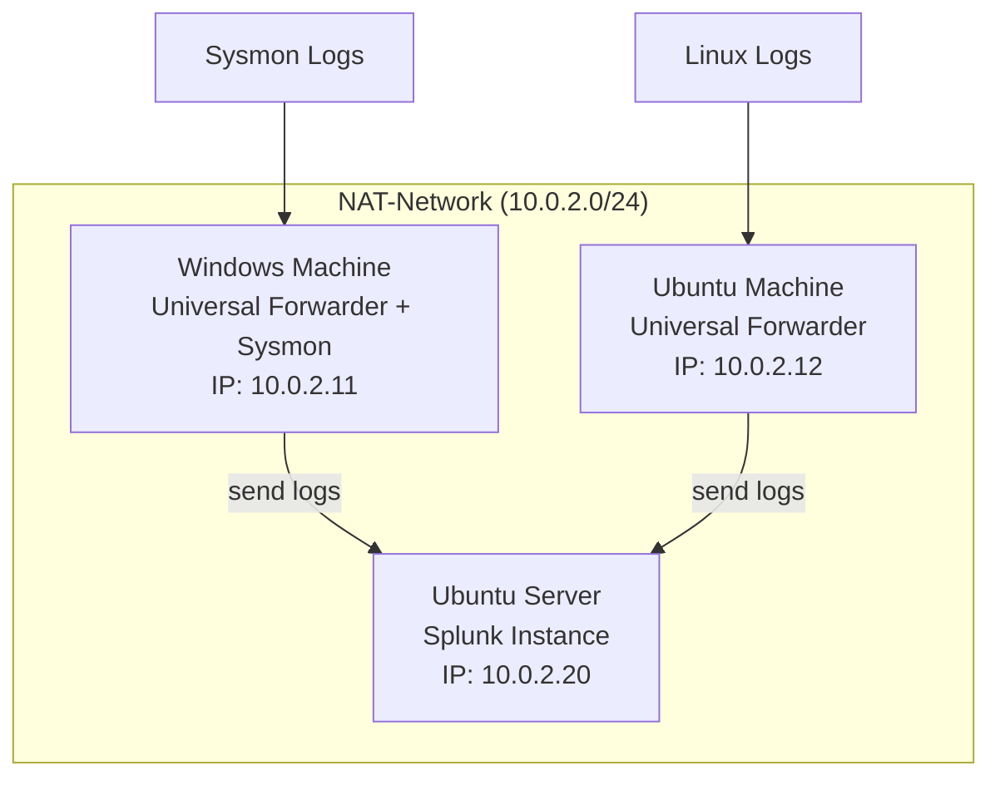

---

### Implementation Steps

### Step 1: Initial Configuration

**Windows Machine**

- Assign a static IP-address (`10.0.2.11`) under the network settings. Open a command-line terminal and enter `ping [google.com](http://google.com)` to verify the internet connectivity.
- [Install Sysmon](https://www.notion.so/Installing-Sysmon-on-a-Windows-Machine-23ecdf9ac8c180afa8def01b00fc34b4?pvs=21).

**Ubuntu Machine**

- Assign a static IP-address (`10.0.2.12`) under the network settings. Open a  terminal and enter `ping [google.com](http://google.com)` to ensure internet connectivity.
    
    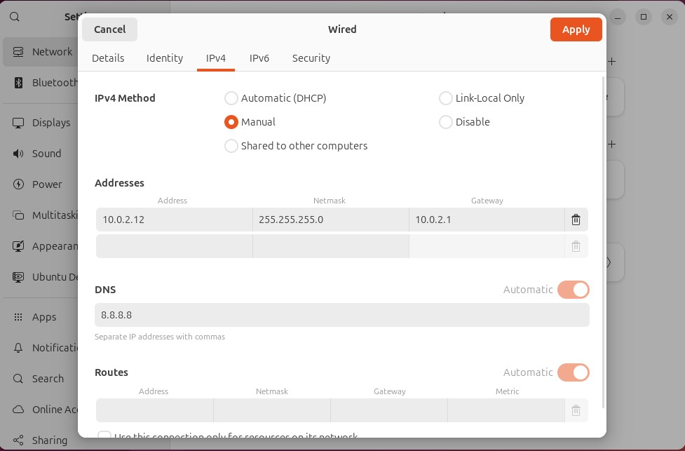
    

**Ubuntu Server**

- **Set a static IP-address** (`10.0.2.20`): Use `sudo nano /etc/netplan/50-cloud-init.yaml` to open the configuration file (in some cases `installer-config.yaml`) in the nano editor.
    
    Change `dhcp4: true` to `dhcp4: no` and add `addresses: [10.0.2.20/24]`, `nameservers` with an additional attribute `addresses: [8.8.8.8]` as attributes of the network interface. Also add `routes` with the list `- to: default` and the attribute `via: 10.0.2.1` . 
    
    - **Explanation**:
        
        **`dhcp4: no`**
        
        Disables DHCP for IPv4. This means the system will **not automatically obtain** an IP address, gateway, or DNS server from a DHCP server.
        
        **`addresses: [10.0.2.20/24]`**
        
        Assigns a **static IP address** to the interface `enp0s3`. The `/24` subnet mask corresponds to `255.255.255.0`, allowing up to **256 IP addresses** in the network.
        
        **`nameservers:`**
        
        Defines the **DNS servers** used for domain name resolution.
        
        With `addresses: [8.8.8.8]`, we're using **Google's public DNS**.
        
        **`routes:`**
        
        Specifies **static routing rules**.
        
        - `to: default` sets the **default route**, which is used for traffic that doesn't match a more specific route.
        - `via: 10.0.2.1` indicates the **default gateway** to which such traffic should be sent.
    
    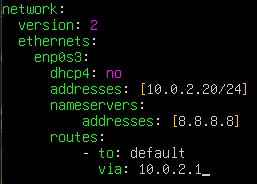
    
    It should look similar to this.
    
- Save the file (Ctrl+X, then Y, then Enter) and apply the changes using `sudo netplan apply`.
- Use `ip a` to verify the servers IP-address and try to `ping google.com` to ensure internet connectivity.
- **Download from Host Machine**: On your host machine (no VM), go to [splunk.com](https://www.splunk.com/) and sign up for an account. Once logged in, navigate to **Products > Free Trials and Downloads > Splunk Enterprise**. Select **Linux** as the operating system and download the **.deb** file. Save this file to a directory that you can easily share with your Ubuntu Server VM
    
    To easily transfer the Splunk installer from your host machine to the Server VM, we'll use VirtualBox's shared folder feature, which requires Guest Additions.
    
- **VBox Shared Folder Features**: First install VirtualBox Guest Additions by running `sudo apt get install virtualbox-guest-additions-iso` followed by `sudo apt get install virtualbox-guest-utils`.
    - **Explanation**:
        
        **VirtualBox Guest Additions** are a set of drivers and utilities installed in the guest OS to enhance performance and integration with the host system. They enable features like shared clipboard, improved display support, and **shared folders**, which allow seamless file exchange between the host and guest operating systems.
        
        `sudo apt-get install virtualbox-guest-additions-iso`
        Installs the ISO file that contains the VirtualBox Guest Additions installer.
        
        `sudo apt-get install virtualbox-guest-utils`
        This installs the utilities and services support Guest Additions functionality.
        
    
    We need to add our user to the vboxsf **group** by running `sudo adduser [your_username] vboxsf`. We’ll need to reboot (`sudo reboot`) the server afterwards for this change to take effect.
    
    In VirtualBox go to **Settings > Shared Folders**. Add a new shared folder. For the **Folder Path**, browse to the directory on your host machine where you saved the Splunk installer. Check **Auto-mount** and **Make Permanent**, and you can select **Read-only.**
    
    After rebooting and logging back into Ubuntu, create a directory for mounting (e.g., `mkdir share`). Then, mount the shared folder using a command like: `sudo mount -t vboxsf -o uid=1000,gid=1000 [shared_folder_name] share` . You should now see the Splunk installer within your `share` directory. 
    
    - **Explanation**:
        
        the `mount` command makes a filesystem accessible at a certain point in the directory tree, `-t vboxsf` specifies the **type** of the filesystem as VirtualBox shared folder, `-o uid=1000,gid=1000` sets the **owner** and **group ownership** of the mounted files to **user** and **group ID** to 1000 (usually the regular user) and the last argument `share` specifies the mounting point in the guest os.
        

### Step 2: Splunk Enterprise Installation & Configuration

**Ubuntu Server**

- **Installation of Splunk Enterprise:** Navigate to the shared directory and run `sudo dpkg -i [splunk_installer_filename.deb]` to install Splunk.
    - **Explanation**:
        
        `dpkg -i [splunk_installer_filename.deb]` : Invokes the debian package manager and `-i` indicates it should install the `[splunk_installer_filename.deb]` file.
        
- **Start Splunk Service**: Once installed, change directory to Splunk's binary folder (`cd /opt/splunk/bin`). Then, start Splunk using `sudo -u splunk bash` followed by `./splunk start`. You will be prompted to **accept the license terms** and **create an administrative username and password** for Splunk.
    - **Explanation**:
        - `sudo -u splunk bash`: Runs the `bash` shell as the `splunk` user.
            - **Important Note**:
                
                The `splunk` user is a **least privilege account** created during Splunk's installation. This account has all the necessary permissions to run the Splunk service.
                
        - `./splunk start`: Starts the Splunk service.
- **Enable Splunk at Boot**: To ensure Splunk starts automatically whenever your VM reboots, run `exit` followed by `sudo /opt/splunk/bin/splunk enable boot-start -user splunk`.
Restart the server. After the reboot we can check the status with `sudo systemctl status splunk.service`.
    - **Explanation:**
        - `exit`: Exits the current shell.
        - `sudo /opt/splunkforwarder/bin/splunk enable boot-start -user splunk`: 
        Enables the Splunk forwarder to start automatically at boot time, running under the `splunk` user account.

**Workstation**

- **Configure Splunk for Receiving Data:** Open a web browser on one of your workstations and navigate to `http://10.0.2.20:8000` (Splunk's default web port). Log in with the administrative credentials you just created.
    
    **Create an Index**: Go to **Settings > Indexes** and click **New Index**. Give it a name (e.g. endpoint) and save it. This is where logs from your machines will be stored. 
    
    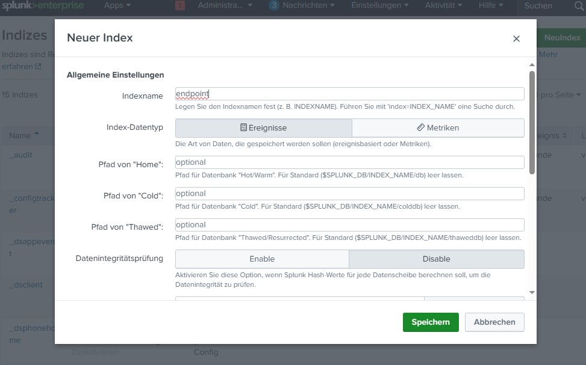
    
    Create a new index.
    
    **Configure Receiving Port**: Go to **Settings > Forwarding and Receiving > Configure Receiving**. Click **New Receiving Port** and enter **9997** (Splunk's default port for receiving forwarded events), then save. 
    
    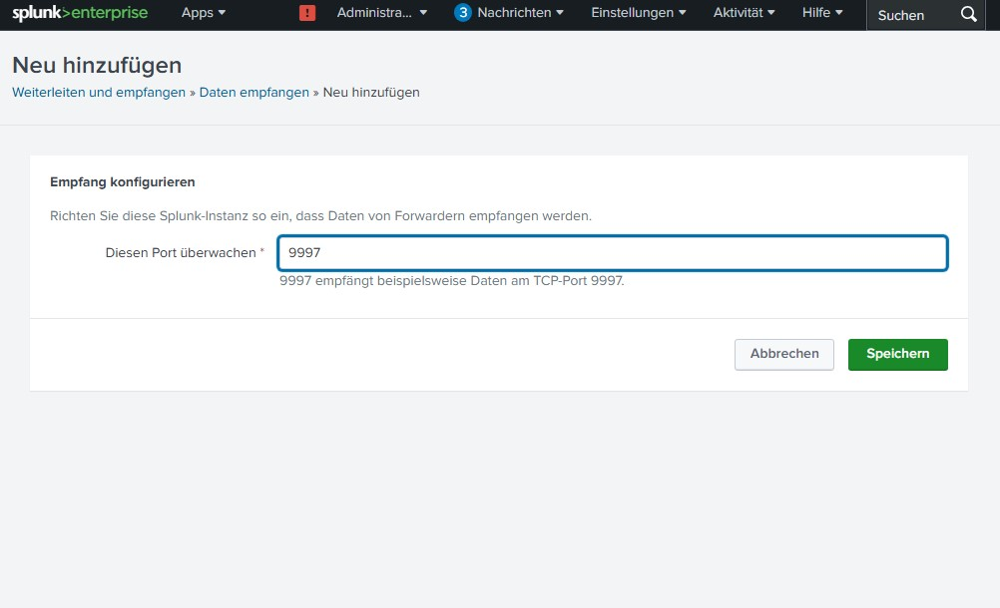
    
    Configure a new receiving port.
    

### Step 3: Universal Forwarder Installation & Configuration

**Windows Machine**

- **Installation of Splunks’s Universal Forwarder**: On your Windows machine, download the **Universal Forwarder** from [https://www.splunk.com/en_us/download.html](https://www.splunk.com/en_us/download.html). Additionally download the SHA512 file to verify the integrity of your download.
    - Verification:
        
        Copy the hash from the SHA512 and open a PowerShell terminal. Use `(Get-FileHash [universal_forwarder_name.msi] -Algorithm SHA512).Hash -eq [copied_hash]` to verify the integrity. 
        
        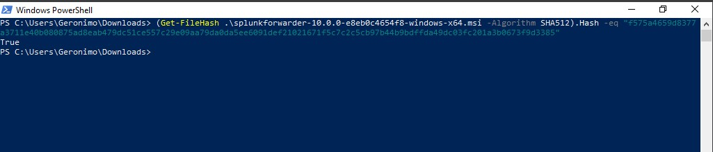
        
    
    Afterwards start the installation process. **Accept the license agreement** by checking the relevant box. Select the **"on premise Splunk Enterprise instance"** option and proceed.
    
    Set a username (e.g., "admin") for the forwarder. You can choose to generate a random password or set your own. 
    
    **Skip the deployment server configuration** as it's not applicable in this setup.
    
    For the **receiving indexer**, input the **IP address of your Splunk server (e.g., `10.0.2.20`)** and use the **default port of 9997** for receiving events. Proceed and click “Install”.
    
- **Configuring the Splunk Forwarder Service:** Go to **Services** and search for the **Splunk Forwarder Service.** Right click on it, **Properties > Login** and select **“Local System account”.** 
Restart the service.
    - **Important Note**:
        
        If the Forwarder Service is configured to use **"NT Service\SplunkForwarder"**, it may encounter permission issues when trying to collect logs.
        
    
    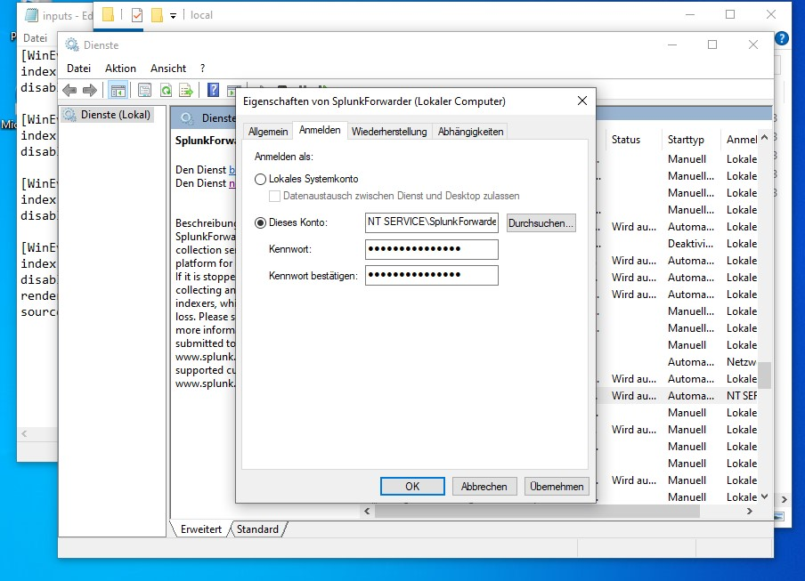
    
- **Log Collection**: We want to configure `inputs.conf` located in `C:\Program Files\SplunkUniversalForwarder\etc\system\default\`. The content of `inputs.conf` instructs the Splunk forwarder to push events related to **application, security,** and **system logs,** as well as **Sysmon data**.
    - Important Note:
        
        **Do not edit** the `inputs.conf` file in the `default` directory **directly.** Instead, you **must create a new inputs.conf file within the local directory** (e.g., `C:\Program Files\SplunkUniversalForwarder\etc\system\local\`). This practice ensures that you have a default configuration to revert to if needed.
        
    
    Therefore open the editor with administrator privileges and enter following configuration:
    
    ```
    [WinEventLog://Application]
    index = endpoint
    disabled = false
    
    [WinEventLog://Security]
    index = endpoint
    disabled = false
    
    [WinEventLog://System]
    index = endpoint
    disabled = false
    
    [WinEventLog://Microsoft-Windows-Sysmon/Operational]
    index = endpoint
    disabled = false
    renderXml = true
    source = XmlWinEventLog:Microsoft-Windows-Sysmon/Operational
    ```
    
    - **Explanation**:
        
        The **input stanza** `[WinEventLog://<LogName>]` enables the collection of the specified `<LogName>` from the **WindowsEventLog API.** All logs get routed to the `endpoint` **index**. The `disabled` flag indicates whether or not the input is `enabled`. The `renderXml = true` flag preserves the **XML format** and the `source` flag sets the event source type to distinguish it from other logs.
        
    
    You need to restart the Splunk Forwarder Service in order for the changes to take effect.
    

**Ubuntu Machine**

- **Installation of Splunks’s Universal Forwarder**: On your Ubuntu machine, download the **Universal Forwarder** from [https://www.splunk.com/en_us/download.html](https://www.splunk.com/en_us/download.html). Additionally download the SHA512 file to verify the integrity of your download.
    - **Verification**:
        
        Use `sha512sum  —check [file_name].deb.sha512` to check the hash sum. 
        
        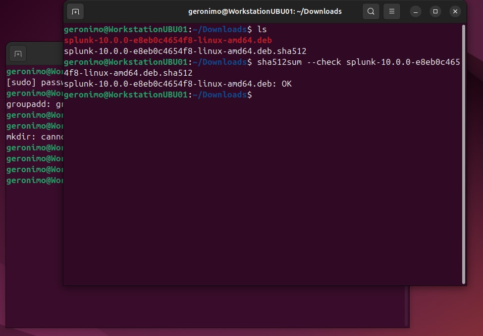
        
    
    Navigate to the download directory (`~/Downloads`) and run `sudo dpkg -i [splunkforwarder_filename].deb` to start the installation.
    
- **Start Forwarder Service**: Once installed, change directory to the binary folder (`cd /opt/splunkforwarder/bin`). Then, start the service using `sudo -u splunkfwd bash` followed by `./splunk start`. You will be prompted to **accept the license terms** and **create an administrative username and password**.
    - **Explanation**:
        - `sudo -u splunkfwd bash` : Runs the `bash` shell as the `splunkfwd` user.
            - **Important Note**:
                
                The `splunkfwd` user is a **least privilege account** created during the forwarder’s installation. This account has all the necessary permissions to run the service.
                
        - `./splunk start`: Starts the forwarder service.
- **Enable Splunk Forwarder at Boot**: To ensure the forwarder starts automatically whenever your VM reboots, stop the service (`./splunk stop`). After the instance stopped, run `exit` followed by `sudo /opt/splunkforwarder/bin/splunk enable boot-start -user splunkfwd` . 
Restart the workstation. After rebooting, we can check the status with `sudo systemctl status SplunkForwarder.service`.
    - **Explanation**:
        - `./splunk stop`: Stops the forwarder service.
        - `exit`: Exits the current shell.
        - `sudo /opt/splunkforwarder/bin/splunk enable boot-start -user splunkfwd`: 
        Enables the Splunk forwarder to start automatically at boot time, running under the `splunkfwd` user account.
- **Configuring the Universal Forwarder**: We want to configure the forwarder using the config files specifically `inputs.-` and `outputs.conf`. To do so navigate to `/opt/splunkforwarder/etc/system/local`.
We want to configuring the data forwarding first. Therefore run `sudo nano outputs.conf` to open/create the configuration file with the nano text editor and insert following configuration:
    
    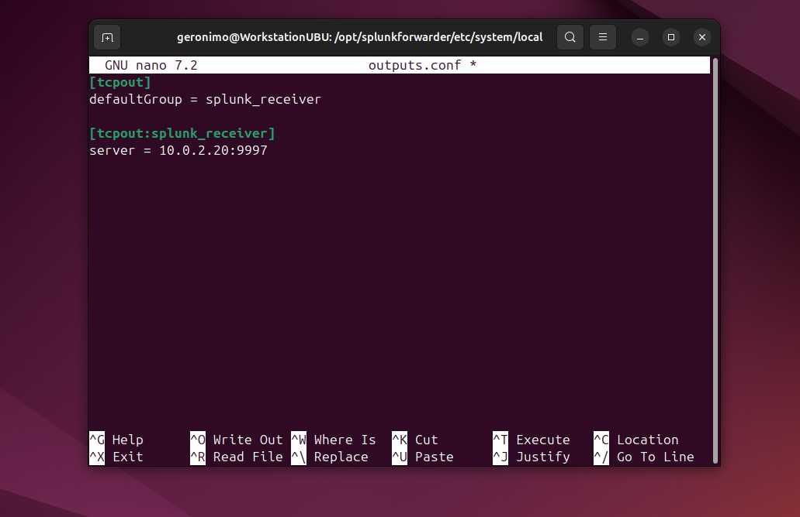
    
    Basic configuration to forward data to the Splunk instance on the Ubuntu server.
    
    - **Explanation**:
        - `[tcpout]`: Splunk stanza to configure data forwarding using tcp.
        - `defaultGroup = splunk_receiver`: 
        This line instructs the forwarder to send all collected data to the group named `splunk_receiver`. This is the default destination for all forwarded data.
        - `[tcpout:splunk_receiver]`: 
        This stanza defines the group that was named in the `defaultGroup` setting. It specifies the actual destinations for the data.
        - `server = 10.0.2.20`: This line specifies the destination of your indexer.
- **Log Collection**: Now we want to configure `inputs.conf`. The content of `inputs.conf` instructs the Splunk forwarder to push events related to the **system** and  **authentication**.
Therefore open/create the configuration file with the nano text editor using `sudo nano inputs.conf` and insert following configuration:
    
    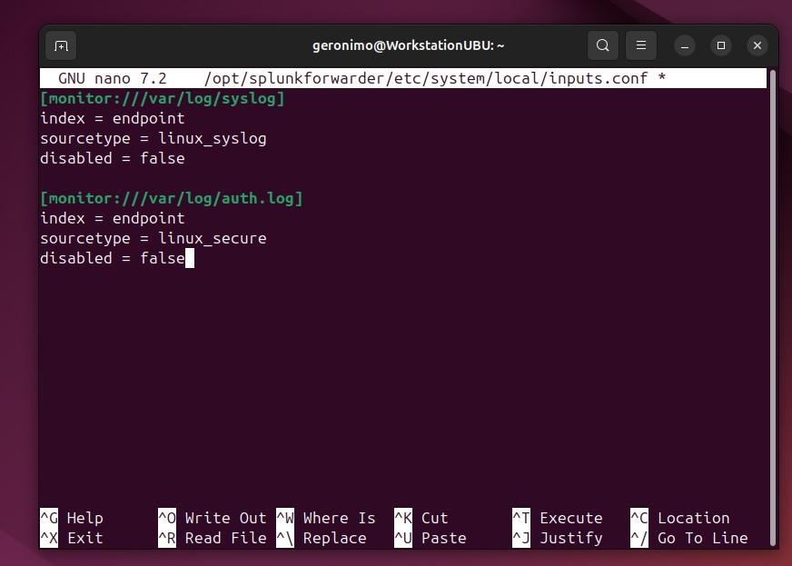
    
    Basic configuration to forward system and authentication logs.
    
    - Explanation:
        - **`[monitor://<path>]`**: This stanza tells Splunk to actively monitor a specific file path. When a new line is added to the file, Splunk reads it and sends the data.
        - `index = <name>`: All logs get routed to the specified index name.
        - **`sourcetype = <name>`**: This setting assigns a type to the incoming data, which helps Splunk automatically parse the events correctly.  Predefined or custom source types can be used.
        - `disabled = true/false`: Indicates whether or not the file path should be monitored.

---

### Verification & Testing

- **Log Ingestion**:
    
    
    
    View of Splunk’s Search & Reporting app. 
    
- **Windows Logs**:
    
    
    
    Using SPL to filter for Windows logs only. We can see, we successfully ingested Application, Security, System and Sysmon logs.
    
- **Linux Logs**:
    
    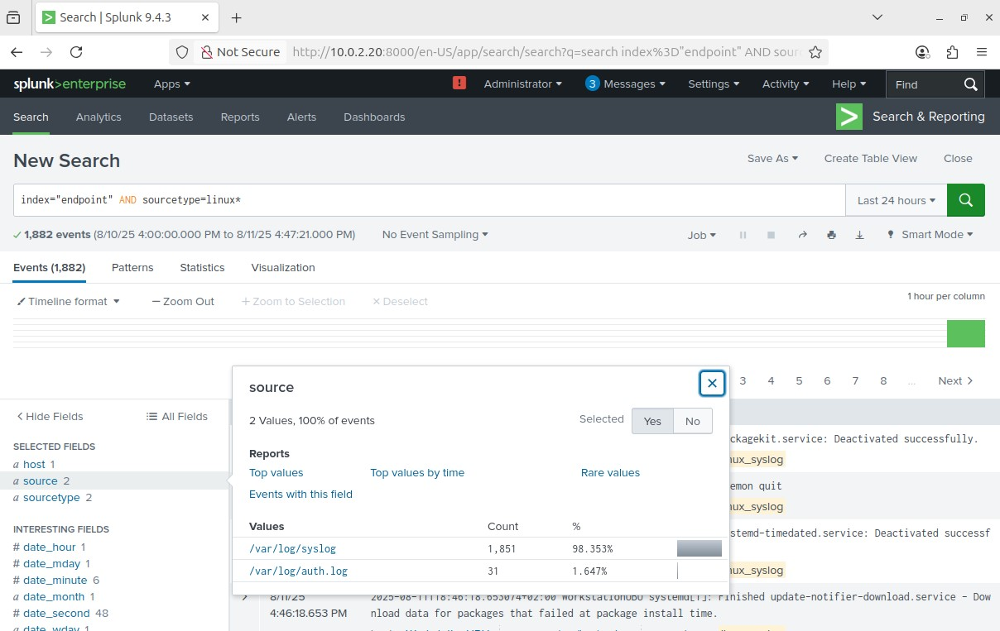
    
    Using SPL to filter for Linux logs only: We can see we successfully ingested authentication and syslog logs.
    

---

### Conclusion & Future Work

- **Summary of Project**: My project involved deploying a Splunk Universal Forwarder on two distinct workstations: one running Windows 10 and the other running Ubuntu. On the Windows host, I enabled and configured Sysmon and set the forwarder to collect Application, Security, System, and Sysmon event logs. On the Ubuntu host, the forwarder was configured to collect authentication and syslog data. Finally, I deployed a Splunk Enterprise server on a dedicated Ubuntu machine, which was configured to receive and index the aforementioned logs from both workstations.
- **Key Learnings**: Installation and configuration of Splunk’s Universal Forwarders on Windows and Linux machines, installation and configuration of Splunk Enterprise on a Ubuntu server, basic log ingestion
- **Potential Next Steps**: Creating custom dashboards and alerts, adding more data sources (e.g. network devices, web servers), integrating threat intelligence feeds, exploring Splunk apps and add-ons

---

**RELATED PAGES**

[Installing Sysmon on a Windows Machine](https://www.notion.so/Installing-Sysmon-on-a-Windows-Machine-23ecdf9ac8c180afa8def01b00fc34b4?pvs=21)

[Splunk SPL Cheat Sheet](https://www.notion.so/Splunk-SPL-Cheat-Sheet-23ecdf9ac8c180a68dd1fe5b604bab9c?pvs=21)
